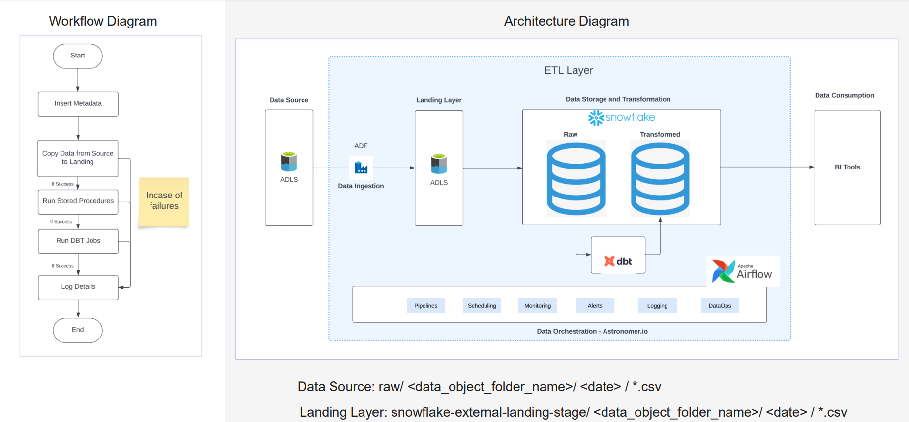

Overview
========

This is the very first project dag  created for a demo architecture for end to end orchestration using Airflow.  

Project Contents
================

Different tools/services Integration 
-------------------------
As airflow is a orchestration tool, we tested it with different tool used for different purposes listed below:
1. Azure Data Factory : Used for ingesting the data from client location(sftp/ftp/adls) to a alds path where we can access this data.
2. Snowflake : Used for datawarehousing purpose.
3. DBT: Used for testing and Transformation purpose.
4. Postgres: Used to store log data based on if dag run fails.
4. Slack: Used for task failure notifications

Along with these components logging,scheduling and altering will be managed by Airflow.

Project Architecture
-------------------------

 
In the Project Architecture, on the left side you can see the worflow diagram which defines the sequence of process to be followed and roght side is actual architecture diagram involving all the components in the project. Two components are still missing in the diagram are postgres db (used for logging) and slack (used for notifying task failures).  
Here were are considering this Architecture to be a delta loads arch and every day we process new data provided by client for yesterdays date.  

Final DAG
-------------------------

The above dag shows all the tasks used for this demo with different services. On the top left corner you can see all the different types of operators used. On the top right corner you can see what all the statuses a task can have in a dag. As I have taken this screenshot while my dag was still running you can see the task to check adf copy run status is in running state. 

Breakdown of DAG and worflow
-------------------------

<h3>1. Insert Metadata </h3>

The first step in the workflow is to insert metadata and same is a task in the dag. This task is used to effectively use logging process. Indepth explanation of this task will be done in the final steps of the dag explanation.
 

<h3>2. Copy Data from Source to Landing </h3>

This is the second step in workflow where we copy the data from Client side ADLS to our ADLS using ADF. Before we run the ADF pipeline, we need to make sure that the data for required date is present in the source path. There are two ADLS account shown client ADLS and landing ADLS and both have the same folder structure. As we dont have access to lots of resources for demo purpose we are using single ADLS account with different containers.  
Source ADLS:  Container name -> raw  
Landing ADLS: Container name -> snowflake-external-landing-stage  
Folder structure: <container_name> / <folder_name> / <date_format> / *.csv    

 
 
Created an ADLS account with name: <i>myorgdatastorage</i> and both the containers are present in the same container.
 
 

 
Here we can see the folder and file structure in adls for source. Similar structure will be for target adls but the target container name would be different as mentioned above.
 

Please note: We will not be running the ADF pipeline directly in Azure, first we will check if the data exist for that particular day for which we want to do the pipeline run. 
 
For this we are using a seperate activity in airflow with Python Operator using python sdks for Azure we are checking if the files and folders exist for that particular day.
There are total 5 tasks here.

<h4>Task 1: <b>Check folders and files </b></h4>
This is a Python task which checks if the file is present for that particular folder and date in the source ADLS.
To connect to Azure we are using stored environmental credentails: <i>AZURE_BLOB_CONN_STR</i> and <i>AZURE_CONTAINER_NAME</i>
We are considering this pipeline to be dynamic where we pass on the <i>object_folder_name </i> and <i>date_folder_name</i>. If atleast one file exists then it outputs a json response and is stored on xcom with key <i>"return_value"</i> and value <i>"{'success': '1', 'error_message': None}"</i>. 
If there are no files in source it will change the  value as <i>"{'success': '0', 'error_message': 'The error received in the Pipeline run is as follows: Either the folder: 2023-06-26 does not exist at raw/employeedata/ Or there are no files at location: raw/employeedata/2023-06-26/'}"</i> 
Below screenshot is the task output showing files exist and success boolean as 1 stored in xcom.
 

<h4>Task 2: <b>Files exist decider </b></h4>
This uses BranchPythonOperator which is a decision task created in python.This checks the output of previous task in xcom and it will decide if we need to log the details and stop the pipeline or continue running the pipeline.

<h4>Task 3: <b>Copy data from ADLS to Landing </b></h4>
This used AzureDataFactoryRunPipelineOperator which a operator created for airflow to run/trigger ADF pipelines. This operator works in sync as well as in a-sync mode. In this demo we have used sync mode. This task returns run_id of the adf pipeline as output in xcom.
 
This uses azure_data_factory_conn_id="azure_data_factory". We have created a connection named "azure_data_factory" in connections in airflow ui.
  
Alternatively you can mention the connection credentials in 

**[airflow_settings.yaml](/airflow_settings.yaml)**.
 
For ADF pipeline we have created two parameters, <i>dataset_name</i> and <i>date</i> and both of these paramters are passed via airflow.
In our case folder name would be "employeedata" and date is "2023-06-24"

<h4>Task 4: <b>ADF load ADLS to Landing success decider </b></h4>
This is a python task which gets the run_id from previous task and get the status of that pipeline run using Azure sdk's. To connect to Azure we are using stored environmental credentails: <i> AZURE_DATA_FACTORY_SUBSCRIPTION_ID </i> and <i> AZURE_RESOURCE_GROUP_NAME </i> and <i> AZURE_DATA_FACTORY_NAME </i> and <i> AZURE_DATA_FACTORY_CLIENT_ID </i> and <i> AZURE_DATA_FACTORY_CLIENT_SECRET </i> and <i> AZURE_DATA_FACTORY_TENANT_ID </i>.
  
If the status of the pipline is success it will output message in json format just like we had in Check folders and files task with key <i>"return_value"</i> and value <i>"{'success': '1', 'error_message': None}"</i>. If there is any error the success will change to '0' and error message will be shown in error_message key.

<h4>Task 5: <b>ADF load ADLS to Landing success decider </b></h4>
This uses BranchPythonOperator which is a decision task created in python.This checks the output of previous task in xcom and it will decide if we need to log the details and stop the pipeline or continue running the pipeline. To connect to Azure we are using stored environmental credentails: <i> AZURE_DATA_FACTORY_SUBSCRIPTION_ID </i> and <i> AZURE_RESOURCE_GROUP_NAME </i> and <i> AZURE_DATA_FACTORY_NAME </i> and <i> AZURE_DATA_FACTORY_CLIENT_ID </i> and <i> AZURE_DATA_FACTORY_CLIENT_SECRET </i> and <i> AZURE_DATA_FACTORY_TENANT_ID </i>.

<h3>3. Run Stored Procedures </h3>

Once the data is the landing adls we need to process the data. For processing data in snowflake, I have created external table on top if the object_folder. The script for external table can be found under [snowflake_scripts](snowflake_scripts/)(Here you will find the script for creating external stage, file format and external table with stored procedure). We need to only process the data for which we did the copy activity for. For this purpose I have created views on top of this external table. Either you can follow this approach or once the data is in landing just create external table on top of that data only(If the datasize is huge this will be the optimal approach). As my dataset size was small, I had gone with simpler apporach for this demo.
 

So there are two views created, one for delta loads where I'm getting the data from external table and filtering it based on date. Other one for Full refresh where I'm selecting the latest record for each employee based on date. Both the views are created as part of stored procedures and can be found [here](snowflake_scripts/030_stored_procedures.sql).
 
Required external tables,view and stored procs are created in db: <i>Airflow</i> and schema: <i>landing</i>

There are total 2 tasks here.
<h4>Task 1: <b>Insert query </b></h4>
This is a python task where we dynamically push the query to ran in snowflake and stored in xcom.

<h4>Task 2: <b>Create view  </b></h4>
This uses SnowflakeOperator which runs the query pushed in above task usign xcom. This uses snowflake_conn_id="snowflake". We have created a connection named "snowflake" in connections in airflow ui.
  
Alternatively you can mention the connection credentials in 

**[airflow_settings.yaml](/airflow_settings.yaml)**.

<h3>5. Run DBT Job </h3>

Once the view is created, we have the data we want to transform in that view. We can have n number of layers in here but for demo purpose we have only one layer which is gold layer. This is where I will store my final dimention "Employee" data. All the latest data for employee should be updated in here. 
So we have incremental data in view. Hence we will upsert the data into target table based on unique key : Employeeid. We can also create hash keys in here for unique key but for the demo purpose we have not created one.
 
The Source View name is as below: 
For Incremental load: <i>airflow.landing.view_stg_employee_filtered_daily</i>  
For Full refresh:<i> airflow.landing.view_stg_employee</i>  

We have created a dbt model named: <i>dim_employees</i> which loads the incremental data using merge statement in final model named "dim_employees" which is present in database: <i>Analytics</i> and schema: <i>Analytics</i>

There are total 3 tasks here. All of them are present under a taskgroup. We can logically group tasks together and call them a task group.
 

<h4>Task 1: <b>Check Job </b></h4>
This used Python Operator which connects to DBT using hooks and checks if same job is currently running or not. If not then proceed with thye dag run. We don't want to run run the DBT job if same on is already running.

<h4>Task 2: <b>Trigger DBT Cloud Job</b></h4>
This task triggers the cloud DBT job and waits for its completion. This task outputs the runid of the job in xcom.
We have created a job which runs this dbt deployment script and trigger that job via airflow.
This uses dbt_cloud_conn_id="dbt_conn". We have created a connection named "dbt_conn" in connections in airflow UI.
  
Alternatively you can mention the connection credentials in 

**[airflow_settings.yaml](/airflow_settings.yaml)**.
The dbt model script is stored  **[here](/docs/process_employee/dbt_scripts/)**.

<h4>Task 3: <b>Get Job Run</b></h4>
This task gets the runid from xcom pushed by previous task and check the status of that task. If the task is success log as dag run succeeded as there is no other task aafter this. Else log as failed with error message.

Once the dbt model is ran successfully we will log the details.

<h3>6. Log Details </h3>

Once all the tasks are ran we want to log the details. Alternatively details will be logged if pipeline fails due to some issue in the data i.e during checking files and folders,running adf pipeline, running dbt job. If task fails due to any other reason then we have configured slack notification for that.

There are total 2 tasks here.  

<h4>Task 1: <b>Process Log </b></h4>
This is a python task which stores the log details in a postgres database.
This uses postgres_conn_id='postgres_neon_tech'. We have created a connection named "postgres_neon_tech" in connections in airflow UI.
  
Alternatively you can mention the connection credentials in 

**[airflow_settings.yaml](/airflow_settings.yaml)**.
<h4>Task 2: <b>Send Email alert </b></h4>
From the previous task output it gets the details and sends an email notification to user.
To connect to GMAIL server we are using stored environmental credentails:  <i>GMAIL_SMTP_SERVER </i> ,<i>GMAIL_SMTP_PORT </i> ,<i>GMAIL_USERNAME </i> ,<i>GMAIL_PASSWORD </i> and <i>EMAIL_TO_USER </i>.

 
The Insert Metadata task we had as the first step in workflow is used for logging details and is explained below.
All of the Decision operators in python when fails goes to log details i.e. log details is a single component to which all of the fail task comvverge to. So this log details task needs to know which task it should refer to get the task faliures error message.
 
For this what we did is we created a python task called insert metadata which pushes two parameters into xcom:  
1. decider_iterator : this is a variable whose value is initally 0. We are incrementing this variable value at every decider step 
2. metadata : This is variable with json values added as metadata. 
 

 

Once that is done, if any task where issue is related to data fails, ex. the source files doesnot exist, then files exist decider will append the value of <i>decider_iterator</i> by 1 and now if it goes to log details, log details will get the <i>metadata</i> from xcom and get value where key equals value of <i>decider_iterator</i> in our case that will be <i> {"check_task": "check_folder_and_files"} </i>. From this dict we will get the value of <i>check_task</i> and use that as a task to get the output from. Similarly we will be doing it for other data related failures. 

 

But if incase there are failures in the pipeline due to issue/errors in functional programming, we are sending slack notification to user and defintion for that is added while defining the dag.This uses slack_webhook_conn_id='slack_conn'. We have created a connection named "slack_conn" in connections in airflow UI.
  
Alternatively you can mention the connection credentials in 

**[airflow_settings.yaml](/airflow_settings.yaml)**.

 

Email notification would something like mentioned below:

 
Success or failure logs in the database would look something like this:

 

I know there are lot of things which can be optimized here. Please let me know if you have some suggestions.

